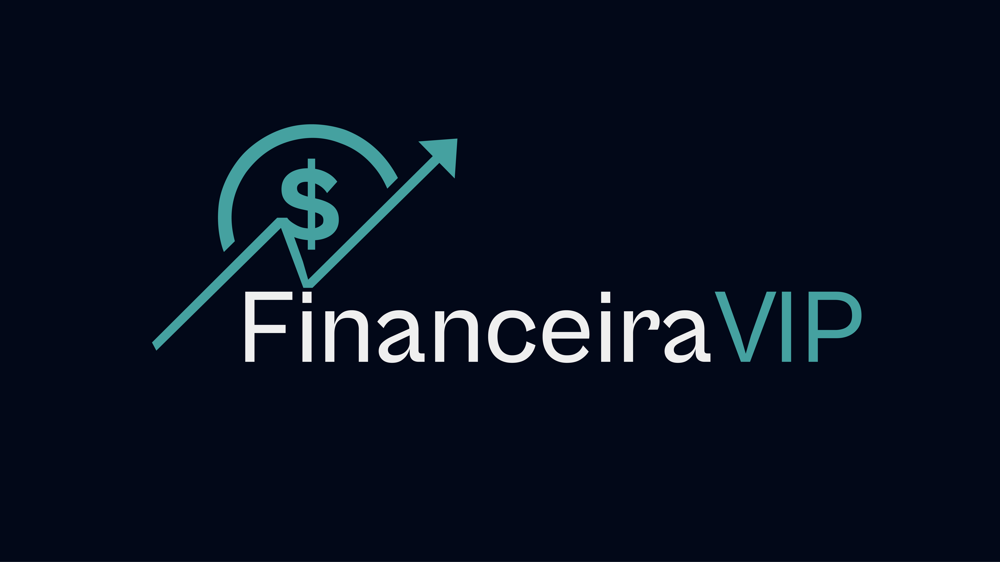

# FinanceiraVIP




> Projeto de uma financeira, que realiza contratos para empresas e pessoas física, desenvolvido em Next.js, com uso de Tailwindcss e a biblioteca de componentes Shadcn/ui.

## ➕Explicação detalhada do projeto.

O projeto inicialmente foi uma atividade realizada em C#, mas pensando em um sistema de fácil acesso para uma empresa poder documentar os seus contratos ativos de empresas e pessoas que requisitaram algum tipo de financiamento.
O sistema foi desenvolvido em Next.js, com o uso de Tailwindcss para estilização, com o auxílio da biblioteca de componentes Shadcn/ui. Além disso, o banco de dados utilizado para guardar os contratos foi o Firebase Realtime Database, um banco de dados nosql da Google.
Vale salientar que o sistema foi construído para fins didáticos, já que foi o meu primeiro projeto Next.js e o primeiro projeto que usei Tailwindcss.
Também foi realizada uma logo para o projeto, foi usada outra logo-base como ideia, mas houve a vetorização e personalização para a atual.

### Ajustes e melhorias.

O projeto continua em desenvolvimento e as próximas atualizações serão voltadas para as seguintes tarefas:

- Adicionar uma tela de login.
- Adicionar configurações de contrato.
- Trabalhar melhor com o conceito de componentes.
- Otimizar os códigos.

## 🚀 Instalando os arquivos da FinanceiraVIP

Para instalar os arquivos da FinanceiraVIP, siga estas etapas:

Windows:

```shell
git clone https://github.com/Vini150cius/FinanceiraVIP.git
```

## 📝 Licença.

O projeto pode ser usado para estudo ou até mesmo reciclado para algum outro projeto, mas caso for utilizar, peço encarecidamente para dar o merecido crédito.
